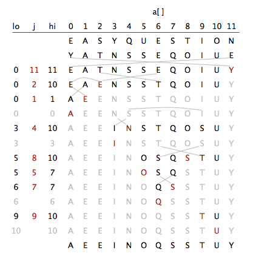

# Quicksort trace 2.3.2

Exercise:

Show, in the style of the quicksort trace, how quicksort sorts the array `E A S Y Q U E S T I O N`. (For the purposes of this exercise, ignore the initial shuffle.)

Solution:

Full trace:

|                       | lo    | i     | j      | hi   | 0        | 1     | 2     | 3        | 4     | 5            |    6     | 7     | 8     | 9            | 10    | 11    |
| --------------------- | ----- | ----- | ------ | ---- | -------- | ----- | ----- | -------- | ----- | ------------ | :------: | ----- | ----- | ------------ | ----- | ----- |
| initial values        |       |       |        |      | **E**    | **A** | **S** | **Y**    | **Q** | **U**        |  **E**   | **S** | **T** | **I**        | **O** | **N** |
| shuffle               |       |       |        |      | **Y**    | **A** | **T** | **N**    | **S** | **S**        |  **E**   | **Q** | **O** | **I**        | **U** | **E** |
| scan left, scan right | 0     | 1     | 11     | 11   | <u>Y</u> | **A** | **T** | **N**    | **S** | **S**        |  **E**   | **Q** | **O** | **I**        | **U** | **E** |
| exchange              | **0** | 1     | **11** | 11   | **E**    | A     | T     | N        | S     | S            |    E     | Q     | O     | I            | U     | **Y** |
| scan left, scan right | 0     | 2     | 6      | 10   | <u>E</u> | **A** | **T** | N        | S     | S            |  **E**   | **Q** | **O** | **I**        | **U** | Y     |
| exchange              | 0     | **2** | **6**  | 10   | <u>E</u> | A     | **E** | N        | S     | S            |  **T**   | Q     | O     | I            | U     | Y     |
| scan left, scan right | 0     | 3     | 2      | 10   | <u>E</u> | A     | E     | **N**    | **S** | **S**        |    T     | Q     | O     | I            | U     | Y     |
| exchange              | **0** | 3     | **2**  | 10   | **E**    | A     | **E** | N        | S     | S            |    T     | Q     | O     | I            | U     | Y     |
| scan left, scan right | 0     | 1     | 1      | 1    | <u>E</u> | **A** | E     | N        | S     | S            |    T     | Q     | O     | I            | U     | Y     |
| exchange              | **0** | 1     | **1**  | 1    | **A**    | **E** | E     | N        | S     | S            |    T     | Q     | O     | I            | U     | Y     |
|                       | 0     |       |        | 0    | **A**    | E     | E     | N        | S     | S            |    T     | Q     | O     | I            | U     | Y     |
| scan left, scan right | 3     | 4     | 9      | 10   | A        | E     | E     | <u>N</u> | **S** | S            |    T     | Q     | O     | **I**        | **U** | Y     |
| exchange              | 3     | **4** | **9**  | 10   | A        | E     | E     | <u>N</u> | **I** | S            |    T     | Q     | O     | **S**        | U     | Y     |
| scan left, scan right | 3     | 5     | 4      | 10   | A        | E     | E     | <u>N</u> | **I** | **S**        |    T     | Q     | O     | S            | U     | Y     |
| exchange              | **3** | 5     | **4**  | 10   | A        | E     | E     | **I**    | **N** | S            |    T     | Q     | O     | S            | U     | Y     |
|                       | 3     |       |        | 3    | A        | E     | E     | **I**    | N     | S            |    T     | Q     | O     | S            | U     | Y     |
| scan left, scan right | 5     | 6     | 9      | 10   | A        | E     | E     | I        | N     | <u>S</u>     |  **T**   | Q     | O     | **S**        | **U** | Y     |
| exchange              | 5     | **6** | **9**  | 10   | A        | E     | E     | I        | N     | <u>S</u>     |  **S**   | Q     | O     | **T**        | U     | Y     |
| scan left, scan right | 5     | 9     | 8      | 10   | A        | E     | E     | I        | N     | <u>S</u>     |    S     | **Q** | **O** | **T**        | U     | Y     |
| exchange              | **5** | 9     | **8**  | 10   | A        | E     | E     | I        | N     | **O**        |    S     | Q     | **S** | T            | U     | Y     |
| scan left, scan right | 5     | 6     | 5      | 7    | A        | E     | E     | I        | N     | **<u>O</u>** |  **S**   | **Q** | S     | T            | U     | Y     |
| exchange              | 5     | 6     | **5**  | 7    | A        | E     | E     | I        | N     | **<u>O</u>** |    S     | Q     | S     | T            | U     | Y     |
| scan left, scan right | 6     | 7     | 7      | 7    | A        | E     | E     | I        | N     | O            | <u>S</u> | **Q** | S     | T            | U     | Y     |
| exchange              | **6** | 7     | **7**  | 7    | A        | E     | E     | I        | N     | O            |  **Q**   | **S** | S     | T            | U     | Y     |
|                       | 6     |       |        | 6    | A        | E     | E     | I        | N     | O            |  **Q**   | S     | S     | T            | U     | Y     |
| scan left, scan right | 9     | 10    | 9      | 10   | A        | E     | E     | I        | N     | O            |    Q     | S     | S     | **<u>T</u>** | **U** | Y     |
| exchange              | **9** | 10    | **9**  | 10   | A        | E     | E     | I        | N     | O            |    Q     | S     | S     | **<u>T</u>** | U     | Y     |
|                       | 10    |       |        | 10   | A        | E     | E     | I        | N     | O            |    Q     | S     | S     | T            | **U** | Y     |
| result                |       |       |        |      | **A**    | **E** | **E** | **I**    | **N** | **O**        |  **Q**   | **S** | **S** | **T**        | **U** | **Y** |